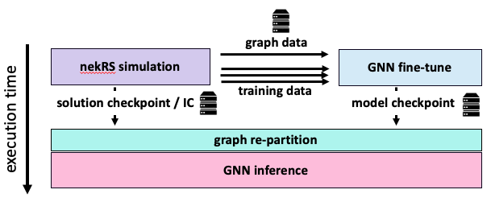
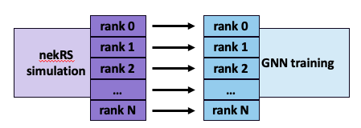

# nekRS-ML: Solution shooting workflow for fluid dynamic simulations with nekRS, a GNN surrogate and ADIOS2

## Description

This benchmark combines a computational fluid dynamics (CFD) simulation with online training and inference of a mesh-based graph neural network (GNN) surrogate model with the goal of "shooting" the solution forward in time, thereby accelerating a long simulation compaign. 
The solution shooting workflow relies on accurate, robust, and efficient surrogate models to advance the solution trajectory in time faster than the high-fidelity CFD code alone. 
To do so, the surrogate can leverage both computational efficiency and larger time integration steps. 

The workflow is composed of the following two stages, run one after the other as shown in Figure 1 below:

* **Online fine-tuning of the GNN surrogate** This stage runs a high-fidelity CFD simulation with the nekRS code and GNN distributed training cuncurrently on the system, streaming training data from the simulation to the trainer at a constant interval.
* **Solution shooting with ML surrogate** This stage deploys the GNN surrogate for inference, starting from a solution checkpoint as initial condition and then rolling out the surrogate by feeding the model predictions back as inputs for the next iteration in order to advance the solution state in time.

<center>

|  | 
|:--:| 
| *Figure 1. Schematic of the solution shooting workflow.* |

</center>

The workflow is made up of the following two components:

* **nekRS:** [nekRS](https://github.com/argonne-lcf/nekRS) is a GPU-capable and highly scalable code for thermal-fluids simulations based on the spectral element method. For portability, the code is based on the open concurrent compute abstraction (OCCA) with CUDA, HIP and SYCL backends. The code leverages advances from [libParanumal](https://github.com/paranumal/libparanumal) and its precursor [nek5000](https://github.com/Nek5000/Nek5000). nekRS was a finlaist for the 2023 ACM Gordon Bell Prize when coupled with a Monte Carlo neutron transport code. More details on nekRS can be found at [this reference](https://www.sciencedirect.com/science/article/pii/S0167819122000710).
* **Mesh-based consistent GNN:** The ML surrogate being used is a distributed GNN for mesh-based modeling using consistent loss and neural message passing layers. The GNN works partitions of the entire graph, called sub-graphs, which are created directly from the CFD mesh used by nekRS, thereby enabling training and inference on extremely large graphs. The GNN implements a halo exchange in the neural message passing layers to ensure node aggregation steps span across sub-graphs. The halo exchanges, together with a consistent loss computation, guarantee continuity in the predictions actross sub-graphs and consistency during training and inference, where consistency refers to the fact that the GNN trained and evaluated on one rank (one large graph) is arithmetically equivalent to evaluations on multiple ranks (a partitioned graph). The GNN is implemented in PyTorch and PyTorch Geometric and distributed training is performed with PyTorch DDP. More details on the GNN can be found at [this reference](https://ieeexplore.ieee.org/abstract/document/10820662).

The workflow is implemented using [ADIOS2](https://github.com/ornladios/ADIOS2) to transfer data between components. The following data transfers are performed, as shown in Figure 1:

* **sub-graph data:** The data structures needed to build the graph and halo exchange information are extracted from the nekRS partitioned mesh and shared with the GNN training component through the file system, since this information is also needed during inference and thus needs to persist beyond the fine-tuning stage. This data is written once at the beginning of the nekRS run, and any I/O performed with this data *is not* included in FOM measurements.
* **training data:** The GNN training data consists of two time steps of the three components of the velocity vector at every mesh grid point (thus at every graph node). Specifically, the input is the solution field at time *t*, *u(t)*, and the output is the the solution at a later time, *u(t+dt)*. This data is streamed between nekRS and GNN training through the ADIOS2 SST engine making use of the system interconnect when scaling up to multiple nodes. Transfer of the training data *is* included in the FOM measurements. Currently, there is a 1-1 relationship between nekRS mesh partitions and GNN sub-graphs, meaning that nekRS and GNN training both run on N MPI ranks. Thus, the training data is transferred in a N-N pattern as shown in Figure 2.  
* **solution checkpoint:** At the end of fine-tuning, nekRS writes a solution checkpoint in order for GNN inference to advance the solution from where the simulation left off. The checkpoint is written to the file system and any I/O with this data *is not* included in FOM measurements.

<center>

|  | 
|:--:| 
| *Figure 2. Schematic of the training data transfer between nekRS and GNN training ranks. Note that the ordered pairing of simulation and training ranks (i.e., rank 0 of nekRS sending data to rank 0 of GNN training) shown in the diagram is not enforced in the benchmark.* |

</center>

## Main system components targeted

Below are the system components the benchmark is designed to stress.

**nekRS**

* Accelerator HBM bandwidth
* More details are upcoming

**Mesh-based consistent GNN**

* Accelerator HBM size: memory size impacts both size of problem (defined by the size of the sub-graph) that can be solved and the model size (no model parallelism)
* Accelerator HBM bandwidth: GNN GEMM, layer-norm, activations, and PyG reduce/scatter kernels are bandwidth bound
* High-speed interconect: GNN halo exchange, which is implemented either as alltoallv or send-receive, requires large buffer sizes (~60MB) and is performed multiple times per training iteration (once per neural message passing layer in forward and backward pass, i.e. 16 times per iteration). An efficient halo exchange is key for scaling the model.

**Online fine-tuning**

* Node DDR size: memory size impacts the number of solution snapshots (i.e., training samples) that can be stored in-memory during fine-tuning
* High-speed interconnect: training data transfer can be a bottleneck at scale on the GNN fine-tuning. Efficient data transfer is key for efficient fine-tuning at scale.
* System design: given specialized hardware for AI and Mod-Sim applications or the use of general purpose accelerators, the workflow measures how this hardware comes together to form the full system 


## Figures of Merit (FOM)

The benchmark collects separate FOM for the fine-tuning and inference stages of the workflow.

For the GNN online fine-tuning stage, the FOM is defined as the Harmonic sum of three FOM measuring throughput of nekRS, GNN training, and the training data transfer, which are the key components of this stage.

```math
FOM_{fine tune} = H(FOM_{nekRS}, FOM_{train}, FOM_{transfer})
```

where

```math
FOM_{nekRS} = \frac{N_{nodes} \times N_{nekRS}}{t_{nekRS}} [mesh nodes / sec] 
```
```math
FOM_{train} = \frac{N_{nodes} \times N_{train}}{t_{train}} [graph nodes / sec] 
```
```math
FOM_{transfer} = \left< \frac{data size}{t_{transfer}} \right> [MB / sec]
```

For the solution shooting stage, the FOM is defined as the ratio of the GNN inference throughput relative to the nekRS throughput, thus evaluating the ability of the GNN surrogate to advance the solution relative to the simulation code.
```math
FOM_{shoot} = \frac{FOM_{inference}}{FOM_{nekRS}}
```

where

```math
FOM_{inference} = \frac{N_{nodes} \times N_{inference}}{t_{inference}} [graph nodes / sec]
```


## Building nekRS-ML

To build nekRS with the required plugins and ADIOS2, simply execute or modify one of the the build scripts provided in the top directory of the nekRS repo.
For example, to build on Aurora execute

```bash
source BuildMeOnAurora
```

Note:

* The build and run scripts for the benchmark rely on the environment variable `NEKRS_HOME` being set. This is where install direcotory for nekRS where the executable will be found along with the header files and the GNN training and inference code. By default, nekRS is installed in the user's home directory, but users can change this variable in the build scripts as desired.


## Running the benchmark

**Warning:** Benchmark run instructions are in the process of being updated.

The ALCF-4 benchmark is located in the [shooting_workflow_adios](./nekRS-ML_ALCF4/examples/shooting_workflow_adios) example within the nekRS repo.
Scripts are provided in the case directory to generate run scripts and config files for the workflow on the different ALCF systems.
Note that a virtual environment with PyTorch Geometric is needed for the GNN.
If you don't specify a virtual environment path, the script will create one for you.
From an interactive session on the compute nodes, first execute
```bash
./gen_run_script
```

taking notice of some of the variables to set. 
Specifically, make sure to set 

```
SYSTEM # the ALCF system to run on (aurora, polaris)
DEPLOYMENT # the deployment strategy for the workflow (colocated, clustered)
NEKRS_HOME # path to the nekRS install directory
VENV_PATH # path to the Python venv activate script
PROJ_ID # project name for the allocation
QUEUE # name of the queue to run on
```

The script generates the run script, which is executed with
```bash
./run.sh
```

The `run.sh` script is composed of two steps:

* First nekRS is run by itself with the `--build-only` flag. This is done such that the `.cache` directory can be built beforehand instead of during online training. This step can be run only once and is helpful to not halt the progress of the benchmark while the cache is built.
* Execution of the workflow driver script `driver.py` with Python, which takes in the setting in the `config.yaml` file and launches fine tuning (nekRS + GNN training) followed by GNN inference on the requested resources. 

The outputs logs of the nekRS, trainer and inference will be within the `./logs` directory created at runtime.


## Rules for running the benchmark

A set of rules for running the nekRS-ML benchmark is upcoming. 