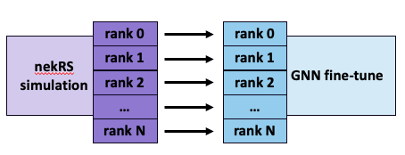

# nekRS-ML: Solution shooting workflow for fluid dynamic simulations with nekRS, a GNN surrogate and ADIOS2

## Description

This benchmark combines a computational fluid dynamics (CFD) simulation with online training and inference of a mesh-based graph neural network (GNN) surrogate model with the goal of "shooting" the solution forward in time, thereby accelerating a long simulation compaign. 
The solution shooting workflow relies on accurate, robust, and efficient surrogate models to advance the solution trajectory in time faster than the high-fidelity CFD code alone. 
To do so, the surrogate can leverage both computational efficiency and larger time integration steps. 

The workflow is composed of the following two stages, run one after the other as shown in Figure 1 below:

* **Online fine-tuning of the GNN surrogate** This stage runs a high-fidelity CFD simulation with the nekRS code and GNN distributed training cuncurrently on the system, streaming training data from the simulation to the trainer at a constant interval. 
* **Solution shooting with ML surrogate** This stage deploys the GNN surrogate for inference, starting from a solution checkpoint as initial condition and then rolling out the surrogate by feeding the model predictions back as inputs for the next iteration in order to advance the solution state in time.

<center>

|  | 
|:--:| 
| *Figure 1. Schematic of the solution shooting workflow.* |

</center>

The workflow is made up of the following two components:

* **nekRS:** [nekRS](https://github.com/argonne-lcf/nekRS) is a GPU-capable and highly scalable code for thermal-fluids simulations based on the spectral element method. For portability, the code is based on the open concurrent compute abstraction (OCCA) with CUDA, HIP and SYCL backends. The code leverages advances from [libParanumal](https://github.com/paranumal/libparanumal) and its precursor [nek5000](https://github.com/Nek5000/Nek5000). nekRS was a finlaist for the 2023 ACM Gordon Bell Prize when coupled with a Monte Carlo neutron transport code. More details on nekRS can be found at [this reference](https://www.sciencedirect.com/science/article/pii/S0167819122000710).
* **Mesh-based consistent and distributed GNN (Dist-GNN):** The ML surrogate being used is a distributed GNN (Dist-GNN) for mesh-based modeling using consistent loss and neural message passing layers. The GNN operates on partitions of the entire graph, called sub-graphs, which are created directly from the CFD mesh used by nekRS, thereby enabling training and inference on extremely large graphs. The Dist-GNN implements a halo exchange in the neural message passing layers to ensure node aggregation steps span across sub-graphs. The halo exchanges, together with a consistent loss computation, guarantee continuity in the predictions actross sub-graphs and consistency during training and inference, where consistency refers to the fact that the GNN trained and evaluated on one rank (one large graph) is arithmetically equivalent to evaluations on multiple ranks (a partitioned graph). Dist-GNN is implemented in PyTorch and PyTorch Geometric and distributed training is performed with PyTorch DDP. More details on the Dist-GNN can be found at [this reference](https://ieeexplore.ieee.org/abstract/document/10820662).

The workflow is implemented using [ADIOS2](https://github.com/ornladios/ADIOS2) to transfer data between components. The following data transfers are performed, as shown in Figure 1:

* **sub-graph data:** The data structures needed to build the graph and halo exchange information are extracted from the nekRS partitioned mesh and shared with the GNN training component through the file system, since this information is also needed during inference and thus needs to persist beyond the fine-tuning stage. This data is written once at the beginning of the nekRS run, and any I/O performed with this data *is not* included in FOM measurements.
* **training data:** The GNN training data consists of two time steps of the three components of the velocity vector at every mesh grid point (thus at every graph node). Specifically, the input is the solution field at time *t*, *u(t)*, and the output is the the solution at a later time, *u(t+dt)*. This data is streamed between nekRS and GNN training through the ADIOS2 SST engine making use of the system interconnect when scaling up to multiple nodes. Transfer of the training data *is* included in the FOM measurements. Currently, there is a 1-1 relationship between nekRS mesh partitions and GNN sub-graphs, meaning that nekRS and GNN training both run on N MPI ranks. Thus, the training data is transferred in a N-N pattern as shown in Figure 2.  
* **solution checkpoint:** At the end of fine-tuning, nekRS writes a solution checkpoint in order for GNN inference to advance the solution from where the simulation left off. The checkpoint is written to the file system and any I/O with this data *is not* included in FOM measurements.

<center>

|  | 
|:--:| 
| *Figure 2. Schematic of the training data transfer between nekRS and GNN training ranks. Note that the ordered pairing of simulation and training ranks (i.e., rank 0 of nekRS sending data to rank 0 of GNN training) shown in the diagram is not enforced in the benchmark.* |

</center>

An important feature of the workflow is that, while nekRS performs a high-fidelity simulation on a mesh discretized with high-order polynomials ($p=7$ in this case), the GNN is trained on a graph created from a coarser discretization of the same mesh ($p=2$). 
Training the surrogate on a coarser graph has the advantage of filtering out some of the dyamics with the finest and fastest scales, thus allowing the surrogate to focus on the coarser and slower dynamics. 
It also allows for both nekRS and GNN training/inference to be run with the appropriate number of grid points per rank needed exercise the hardware in each of the components. 
This multi-resolution discretization is handled automatically by the run scripts and will be defined in the `.par` input file to nekRS. 


## Main system components targeted

Below are the system components the benchmark is designed to stress.

**nekRS**

* Accelerator HBM bandwidth
  * Main kernels for pressure and velocity solve via iterative algorithms such as conjugate gradient are bandwidth bound
* High-speed interconnect
  * MPI communication during time step loop dominated by Isend/Irecv

See the [nekRS performance analysis slides](./material/nekRS_performance_analysis.pdf) for more details.

**Dist-GNN Training and Inference**

* Accelerator HBM size
    * Memory size impacts the size of the problem that can be solved, defined by the size of the sub-graph we can fit on each GPU, thus the total graph size on the entire system
    * Memory size also impacts the model size (number of parameters) since there is no model parallelism and both the sub-graph batch and the model (and associalted memory during forward and backward passes) must fit in memory
* Accelerator HBM bandwidth
    * GEMM, layer-norm, activations, and PyTorch Geometric reduce/scatter kernels are bandwidth bound
* High-speed interconect
    * Dist-GNN halo exchange, which is performed via `torch.distributed.nn.all_to_all`, is performed multiple times per training iteration (once per neural message passing layer in forward and backward pass, i.e. 16 times per iteration with the standard model configuration). An efficient halo exchange is key for scaling the model.

See the [Dist-GNN performance analysis slides](./material/GNN_performance_analysis.pdf) for more details.

**Online fine-tuning**

* High-speed interconnect
  * Efficient data transfer between nekRS and Dist-GNN training is important for efficient fine-tuning at scale. The clustered deployment specifically tests the bisection bandwidth of the interconnect. 
* System design
  * Given specialized hardware for AI and Mod-Sim applications or the use of general purpose accelerators, the workflow measures how this hardware comes together to form the full system 

See the [data transfer performance analysis slides](./material/data_transfer_perf_analysis.pdf) for more details.

## Figures of Merit (FOMs)

The benchmark collects separate FOMs for the fine-tuning and solution shooting stages of the workflow. Both the fine-tuning and shooting FOMs should be reported to score the performance of the workflow. Additioanlly, please also report the FOMs for the individual components (the workflow driver script prints all this information) in order to understand the contributions of the individual components. 

For the GNN online fine-tuning stage, the FOM is defined as the Harmonic mean of three FOMs measuring throughput of nekRS, GNN training, and the training data transfer, which are the key components of this stage.

```math
FOM_{fine \: tune} = H(FOM_{nekRS}, \: FOM_{train}, \: FOM_{transfer})
```

where

```math
FOM_{nekRS} = \frac{N_{nodes} \times N_{nekRS}}{t_{nekRS}} \quad \text{[million mesh nodes / sec]}
```
```math
FOM_{train} = \frac{N_{nodes} \times N_{train}}{t_{train}} \quad \text{[million graph nodes / sec]}
```
```math
FOM_{transfer} = \left< \frac{data \: size}{t_{transfer}} \right> \quad \text{[GB / sec]}
```

and $N_{nekRS}$, $N_{train}$ are the number of nekRS time steps and GNN training steps performed, respectively. The number of mesh and graph nodes is measured in units of millions, and the data size in units of GB.

For the solution shooting stage, the FOM is defined as the ratio of the GNN inference throughput relative to the nekRS throughput, thus evaluating the ability of the GNN surrogate to advance the solution relative to the simulation code.
```math
FOM_{shoot} = \frac{FOM_{inference} \times dt_{ratio}}{FOM_{nekRS}}
```

where

```math
FOM_{inference} = \frac{N_{nodes} \times N_{inference}}{t_{inference}} \quad \text{[million graph nodes / sec]}
```
```math
dt_{ratio} = \frac{dt_{GNN}}{dt_{nekRS}} \quad \text{[ratio of GNN to nekRS time step size]}
```

and $N_{inference}$ is the number of GNN inference steps performed. The number of mesh and graph nodes is measured in units of millions, and the time step ratio $dt_{ratio}$ is fixed to 10 by the science case.


## Building nekRS-ML

The version of nekRS-ML used for the ALCF-4 benchmark is the `alcf4` branch of the nekRS-ML repo. 
You can fine the source code [at this link](https://github.com/argonne-lcf/nekRS-ML/tree/alcf4).

To build nekRS with the required plugins and ADIOS2, simply execute or modify one of the the build scripts provided in the top directory of the nekRS repo.

For example, to build on ALCF Aurora execute

```bash
./BuildMeOnAurora
```

and to build on ALCF Polaris execute

```bash
./BuildMeOnPolaris
```

Note:

* The build scripts will ask for the desired path to the install directory for nekRS. By default, nekRS is installed in the user's home directory, but users can provide the desired path as an input to the scripts.


## Running the benchmark

**Warning:** Please check on the run instructions periodically as we refine the benchmark.


The ALCF-4 benchmark is located in the [shooting_workflow_adios](https://github.com/argonne-lcf/nekRS-ML/tree/alcf4/examples/shooting_workflow_adios) example within the `alcf4` branch of the [nekRS-ML](https://github.com/argonne-lcf/nekRS-ML/tree/alcf4) repo.
Instructions and the necessary scripts are provided in the benchmark directory, but are also summarized below.

After building nekRS-ML, the `gen_run_script` can be used to generate the run/submit script, called `run.sh`, and the configuration file, called `config.yaml`, for the workflow. 
For example, to generate a run script for Aurora, execute the following script **from a compute node**

```bash
./gen_run_script system_name /path/to/nekRS
```

taking notice of some important parameters:

* `system_name`: This is the ALCF system to run on and determines which nekRS config script to run (e.g., [nrsrun_aurora](https://github.com/argonne-lcf/nekRS-ML/blob/alcf4/examples/shooting_workflow_adios/nrsrun_aurora) for Aurora). Please take a close look at these scripts for details on how the config file is generated, what environment variables are set, and how the workflow is executed.
* `/path/to/nekRS`: The path to the install directory where nekRS was built
* `--client`: This selects the client to be used to transfer data during online training and must be set to `adios` for this benchmark. This parameter is already set in `gen_run_script`.
* `--deployment`: This selects the deployment strategy for the workflow. It is set to `clustered` for this benchmark (see the [data transfer performance analysis slides](./material/data_transfer_perf_analysis.pdf) for more detail on the deployment startegy).
* `--venv_path`: The path to a virtual environment to load. This is not needed if the base environment has all the dependencies needed by the GNN. If a venv is not specified, the script will create one and install the needed dependencies.
* For a full list of parameters accepted by `gen_run_script`, execute `./gen_run_script --help`.

The `run.sh` script is composed of two steps:

* First nekRS is run by itself with the `--build-only` flag. This is done such that the `.cache` directory can be built beforehand instead of during online training. This step can be run only once (unless major code changes require the cache to be updated) and is helpful to avoid halting the progress of the benchmark while the cache is built. Note that if the mesh size changes (the problem is scaled up or down), the cache needs to be rebuilt. 
* Then, the workflow is executed with `python driver.py`, where [driver.py](https://github.com/argonne-lcf/nekRS-ML/blob/alcf4/examples/shooting_workflow_adios/driver.py) is the workflow driver script. The configuration of the workflow and its components is defined in the `config.yaml` file, generated by the nekRS config scripts in the step above. The driver first launches fine tuning (nekRS + GNN training) followed by GNN inference on the requested resources. 

The outputs logs of the nekRS, trainer and inference will be within the `./logs_<job_id>` directory created at runtime. The driver script will output all FOM measurements requested.


## Aurora FOMs

**Warning:** Please check on the FOMs periodically as we refine the benchmark.

Below are the FOMs collected on the Aurora system at ALCF. In the table, one PVC tile is considered as a GPU, and the total node and GPU count used by the workflow are reported in the first and second columns (recall, during fine-tuning the GPUs are split evenly between nekRS and GNN training, while during solution shooting all GPUs are assigned to perform inference with the GNN).

| Node count | GPU count | FOM_nekRS | FOM_train | FOM_transfer | FOM_inference | FOM_fine_tune | FOM_shoot |
| --- | --- | --- |
| 1 | 12 | 0.0 | 0.0 | 0.0 | 0.0 | 0.0 | 0.0 |


## Rules for running the benchmark

**Warning:** Please check on the run rules periodically as we refine the benchmark.

### "As Is" FOMs
The compile scripts contained in the benchmark repository may be modified as necessary to get the benchmark to compile and to run on the Offeror ’s system. 
The workflow must be run with ADIOS2 or MPI as a transport layer between nekRS and the GNN trainer during fine-tuning in order to exercise the system's interconnect.

Allowed changes include:

* Optimizations obtained from standard compiler flags and other compiler flag hints that do not require modifications of the source code. 
* Changes in the system software, such as expected improvements to compilers, threading runtimes, and MPI implementations can be considered.

Changes not permitted:

* The workflow must be run in a clustered configuration ensuring that the nekRS and GNN fine-tuning components run on separate set of nodes, thus forcing the data transfer to occurr over the interconnect. 


### Optimized FOMs

Allowed changes:

* The Offeror is allowed to change how the data transfer between nekRS and GNN fine-tuning occurrs, considering other solutions such as the file system, however the workflow must still be run in a clustered configuration. 

